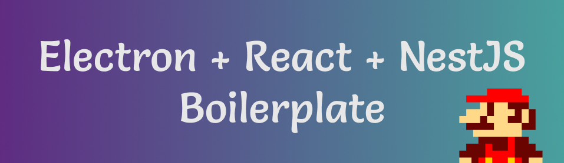
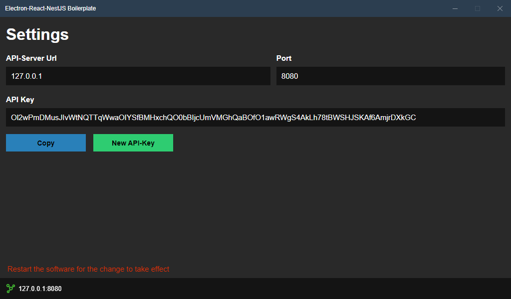

<div align="center">

[](https://david-dm.org/MaxAtslega/electron-react-nestjs-boilerplate)
[](https://david-dm.org/MaxAtslega/electron-react-nestjs-boilerplate?type=dev)

</div>

Electron React NestJS Boilerplate uses Electron, React, NestJS, Webpack and TypeScript with example User API

## Screenshot


## Install
```bash
$ git clone https://github.com/MaxAtslega/electron-react-nestjs-boilerplate.git your-project-name
$ cd your-project-name
$ npm install
```

## Running the app
```bash
# development in watch mode
$ npm run dev

# Build the app
$ npm run build 
```

## Test
```bash
# unit tests
$ npm run test

# eslint test
$ npm run lint
```

## Packaging for Production

To package apps for the local platform:

```bash
$ npm run package
```

## Maintainer
- [Max Atslega](https://github.com/MaxAtslega)

## License
MIT © [Electron React NestJS Boilerplate](https://github.com/MaxAtslega/electron-react-nestjs-boilerplate)